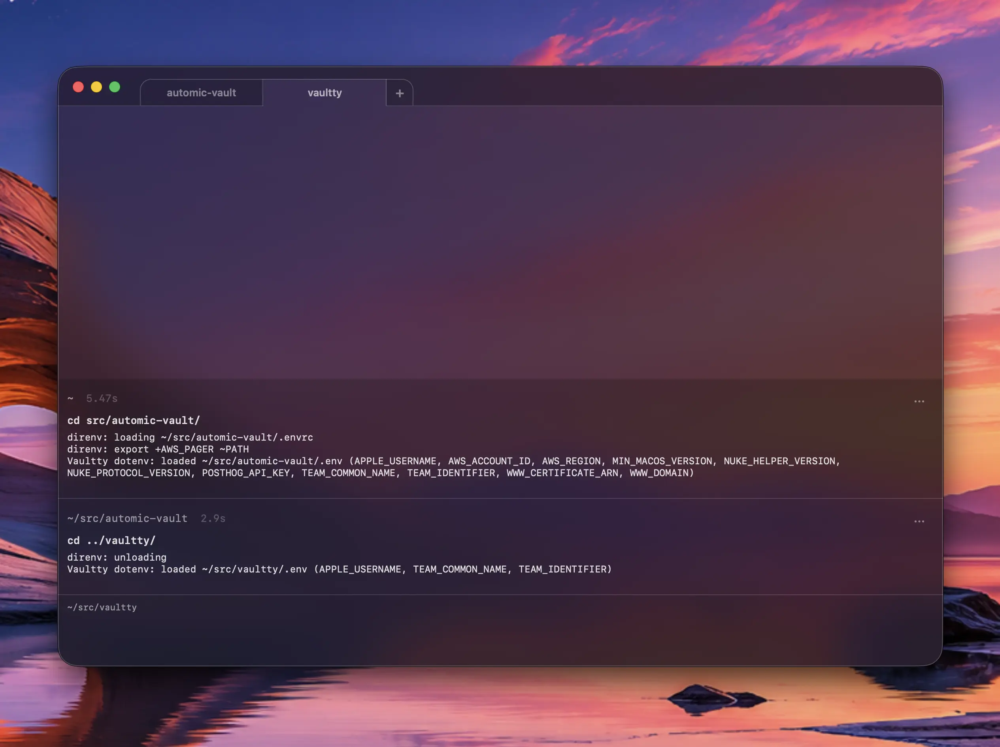

# Vaultty

`Vaultty` is a macOS block terminal for Automic Vault workflows.

The app owns command input and renders command output as blocks. It uses a
persistent shell process, private OSC lifecycle markers, and a bundled
`vaultty-env` helper that reads Automic Vault dotenv keys directly from Keychain.
It does not call `av dotenv export`.



## Features

- The macOS Tahoe appearance you’ve been waiting for.
  Proper (occluding) blur, vibrancy, and translucency.
- [Warp](https://warp.dev) style blocks
- [Fig](https://fig.io) autocompletions
- Automically loads Automic Vault encrypted `.env` secrets without approval
- [libghostty](https://github.com/mitchellh/ghostty) as the tty layer
- Persistent shell sessions that survive closed tabs and app quits

> [!WARNING]
>
> Vaultty currently executes bundled Fig completion generator commands through
> `/bin/zsh -lc` for compatibility with specs that rely on shell quoting, pipes,
> redirects, and command syntax. Completion specs and custom generators can
> therefore execute shell code. This is a known security hole; the intended fix
> is to sandbox or otherwise constrain completion execution without breaking Fig
> compatibility.

> [!IMPORTANT]
>
> Yes this means an agent with Computer Use could use Vaultty to exfiltrate
> secrets. But Computer Use also means that the agent could approve in Automic
> Vault too. If you are not using the AV iPhone app, or transferring approvals
> to another machine then Vaultty is convenient and as-secure.

## Sessions Survive Tabs

Vaultty does not treat a tab close as a shell death sentence.

```sh
$ scripts/build-app.sh --release
# close the tab
# reopen it with Cmd-Shift-T, or join it from the session picker in a new tab
```

Tabs detach from a Vaultty-owned `vaultty-sessiond` helper. The helper keeps the
PTY alive, and Vaultty can rejoin it later with terminal history and session
metadata.

New tabs show existing sessions above the command bar. Pick one to join it; the
fresh shell created for that new tab is discarded.

> [!NOTE]
>
> Vaultty only saves sessions after you run at least one command. Open a new tab,
> type nothing, close it, and it vanishes. This is a feature, not a lifestyle
> choice.

Closed sessions sit in the closed-tab stack:

- `Cmd-Shift-T` rejoins the most recently closed session.
- `Window > Kill Closed Tabs...` kills only sessions in that closed-tab stack.
- Visible tabs in other Vaultty windows are not shown in the picker for the
  current window.

## Remote Sessions

Vaultty can also list and attach to sessions owned by your Unix account on
configured SSH hosts. The app does not open a LAN terminal listener and does not
store SSH passwords or private keys; SSH host keys, agent keys, and account
authorization remain the trust boundary.

Use `Window > Manage SSH Hosts...` to add a host. Enrollment verifies:

```sh
ssh -o BatchMode=yes -T user@host 'vaultty-session-bridge --version'
```

If the bridge is missing, Vaultty saves the host as unenrolled and shows an
install command. The remote side needs both helpers in the same directory:

```sh
vaultty-session-bridge
vaultty-sessiond
```

Once enrolled, remote sessions appear in the new-tab session picker alongside
local sessions. Attaching is a full terminal attach over `ssh -T`; the remote
`vaultty-session-bridge` proxies the existing Vaultty line protocol to the
remote user's private `vaultty-sessiond` Unix socket.

## Build

```sh
scripts/build-app.sh --release
```

The build script signs the app with the Developer ID identity associated with
`TEAM_COMMON_NAME` in `~/src/automic-vault/.env`.

## Versioning

`Cargo.toml` is the source of truth. By default, `scripts/publish.sh` asks Codex
for release notes and the next semantic version based on changes since the last
release, updates `Cargo.toml` and `Cargo.lock`, commits `vX.Y.Z`, pushes the
branch, then publishes GitHub release tag `vX.Y.Z` from the built app bundle.
With `--clobber`, it rebuilds and replaces the existing GitHub release for the
current Cargo version without asking Codex for notes or a new version.
`scripts/build-app.sh` stamps the Cargo version into `CFBundleShortVersionString`
and sets `CFBundleVersion` from the git commit count.

## Ghostty Integration

```sh
scripts/build-libghostty-vt.sh
scripts/build-app.sh --release --with-ghostty-vt
```

`libghostty-vt` is pinned to Ghostty `v1.3.1`, whose `build.zig.zon` requires
Zig `0.15.2`. `scripts/fetch-zig-0.15.2.sh` downloads the official arm64 macOS
Zig tarball and verifies its SHA-256 checksum. If Zig `0.15.2` cannot link
against the installed macOS SDK, the Ghostty build fails loudly and logs to
`target/logs/libghostty-vt-build.log` instead of silently shipping a terminal
that only pretends to use Ghostty.
